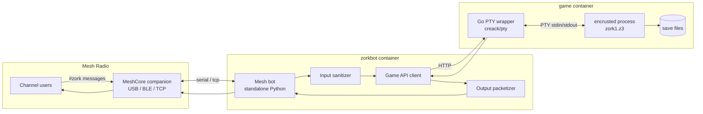

# Zorkbot — Initial Planning Document

**Status:** Draft  
**Created:** 2026-07-27  
**Repo:** `zorkbot` (standalone project)

## Summary

Zorkbot is a MeshCore radio bot that listens on a dedicated channel, forwards player text to a Zork I game running under [encrusted](https://github.com/DeMille/encrusted), and returns game output split across multiple mesh packets (~100 characters, word-boundary breaks). It runs on a 64-bit Raspberry Pi, deployed via Docker with the mesh bot and game engine in separate containers.

## Goals

- Let mesh users play a **shared** instance of Zork I over radio
- Keep mesh messages within practical size limits (~100 chars per packet)
- Block encrusted debug commands and privileged operations from normal users
- Run reliably on Linux (64-bit Raspberry Pi) in Docker

## Non-Goals (v1)

- Per-user game sessions
- Publishing as an ottobot plugin or fork
- Exposing the game service to the public internet

---

## Architecture



### Containers

| Container | Role | Stack |
|-----------|------|-------|
| `zorkbot` | Mesh I/O, command parsing, filtering, packetization, admin checks | Python 3.13+, [`meshcore`](https://pypi.org/project/meshcore/) |
| `game` | Long-lived encrusted process behind a Go HTTP API | Go + [creack/pty](https://github.com/creack/pty), encrusted (Rust) |

The game service binds only on the Docker internal network — not exposed to the host LAN.

---

## Design Decisions

| Decision | Choice | Rationale |
|----------|--------|-----------|
| Game sessions | **Shared** — one world for all players | Fits mesh radio UX; one encrusted process is light on a Pi |
| Mesh channel | **`#zork`** | Dedicated channel for game traffic |
| Bot name | **`zorkbot`** | Device name on mesh; commands are `!zork ...` on `#zork` |
| Bot framework | **Standalone** | Not a fork of [ottobot](https://github.com/tahnok/ottobot); uses meshcore directly, borrowing ottobot patterns where useful |
| Game wrapper | **Go + creack/pty** | Single static binary, clean PTY handling for encrusted's TTY expectations |
| Interpreter | **encrusted** | User preference; v3 Z-machine, terminal-native |
| Game data | `zork1.z3` from [historicalsource/zork1](https://github.com/historicalsource/zork1) | MIT-licensed; mounted at runtime, not committed to repo |
| Packet size | ~100 characters | Leaves headroom below MeshCore's ~140 char truncation |
| Concurrency | Serial command queue | One command at a time via lock; busy reply if contested |

---

## User Interaction

### Addressing

On `#zork`, send commands starting with `!zork`, `!help`, or `!commands`:

```
!zork look
!help
!commands
!zork take lamp
!zork go north
```

No bot mention is required. You may also prefix any command with `@[zorkbot]`. The bot only responds on the `#zork` channel.

### Commands

| Command | Who | Purpose |
|---------|-----|---------|
| `!zork <text>` | Everyone | Send a game command to the shared world |
| `!zork` | Everyone | Bot status (uptime, busy state, brief help) |
| `!zork help`, `!help`, `!commands` | Everyone | Bot-side help (not encrusted `$help`) |
| `!zork save` | Admin | Trigger encrusted `save` |
| `!zork restore` | Admin | Trigger encrusted `restore` |
| `!zork reset` | Admin | Restart the game from scratch |

### Channel Policy

- Bot joins and listens on **`#zork`** only (or answers commands only on that channel slot).
- Game commands from other channels are ignored.
- On startup, bot may announce: *"Zork I is live on #zork — try `!zork look`"*

### Shared Game Behavior

All players share one game state. Anyone can affect the world. Document this clearly in `!zork help`. Commands are processed one at a time; concurrent requests receive a busy message.

---

## Input Sanitization

Apply filtering in **both** the zorkbot container and the game wrapper (defense in depth).

### Blocked for all users (never forwarded to encrusted)

Encrusted intercepts `$`-prefixed input before it reaches the game. These must never be sent:

```
$help  $quit  $undo  $redo  $dump  $dict  $tree  $room  $you
$find  $object  $parent  $attrs  $props  $simple  $header
$history  $have_attr  $have_prop  $steal  $teleport
```

`$quit` calls `process::exit(0)` and would kill the game process.

Additional blocks:

- Any input starting with `$`
- `save` / `restore` / `quit` when the sender is **not** an admin (routed via `!zork save` / `!zork restore` / `!zork quit` instead)
- Empty input
- Control characters and ANSI sequences in input
- Embedded newlines (one command per mesh message)
- Input longer than 80 characters (Zork parser limit)

Rejected commands return a short channel message, e.g. *"That command isn't allowed."*

### Admin-only: save / restore / quit

Normal users cannot send raw `save`, `restore`, or `quit` to encrusted. Admins use bot commands:

```
!zork save
!zork restore
```

The bot verifies admin status, then forwards the literal `save` or `restore` string to the game service.

### Admin Authorization

MeshCore channel messages do not carry a trustworthy sender identity (`sender_name` is spoofable per ottobot/meshcore docs). Admin gating options to evaluate during implementation:

1. **Config allowlist** of admin names (weak, convenience-only)
2. **Shared secret** passed as `!zork save <secret>` (stronger)
3. **Admin-only side channel** (e.g. direct config on the Pi, not over mesh)

Recommend combining (1) for UX with (2) for sensitive ops (`reset`, `restore`). Document that name-based admin is advisory.

---

## Output Packetization

MeshCore truncates messages around **140 characters**. Target **~100 characters** per packet.

### Algorithm

Greedy word-boundary packing (same approach as ottobot's `!help` chunker):

1. Strip ANSI escape sequences from encrusted output
2. Collapse excessive blank lines
3. Optionally prefix packets with `@[sender] ` — budget prefix length against the 100-char limit
4. Pack words into chunks without splitting mid-word
5. Optionally append sequence markers for multi-packet replies: `(1/3)`
6. Send each chunk as a separate mesh message

### Example

Game output:

```
You are in a forest.  There is a large tree here.  A small path leads north.
```

Might become two packets:

```
(1/2) You are in a forest. There is a large tree here. A small path
(2/2) leads north.
```

---

## Game Service (Go Wrapper)

### Responsibilities

1. Spawn `encrusted /game/zork1.z3` attached to a PTY via creack/pty
2. Set terminal size (e.g. 80×24) with `TIOCSWINSZ`
3. Consume startup banner / intro text once at boot
4. Expose HTTP API on port 8080 (Docker internal only)
5. On each request: sanitize → write `command\n` to PTY → read until prompt → strip ANSI → return text
6. Persist encrusted save files to `/data/saves` (mounted volume)
7. Restart encrusted on crash, timeout, or admin reset
8. Enforce its own copy of the input sanitizer

### API

```
POST /command
  Body: {"text": "take lamp", "admin": false}
  Response: {"output": "Taken.\n", "ok": true}

POST /reset
  Headers: X-Admin-Token: <secret>
  Response: {"ok": true}

GET /health
  Response: 200 when encrusted PTY session is alive

GET /status
  Response: {"uptime": "...", "busy": false}
```

### Timeouts

- Per-command timeout: 30 seconds
- On timeout: kill PTY session, respawn encrusted, return error to bot

### PTY Rationale

Encrusted checks `atty::is(Stream::Stdout)` and uses alternate-screen mode, word wrapping, and ANSI formatting on a real TTY. Piping stdin/stdout directly sets `width = 0` and breaks wrapping. A PTY gives encrusted normal terminal behavior.

---

## Zorkbot Service (Python)

Standalone bot using the `meshcore` Python library directly. Not based on ottobot, but may borrow:

- Command prefix / addressing patterns
- Multi-packet reply logic
- Docker hardening (read-only root, `group_add` for serial)
- `--simulate` mode for local dev without hardware

### Modules (planned)

```
src/zorkbot/
├── bot.py           # mesh connection, dispatch loop
├── channels.py      # #zork channel config
├── commands/
│   └── zork.py      # !zork handler
├── sanitize.py      # input filter
├── packetize.py     # word-boundary splitter
├── game_client.py   # HTTP client to game service
└── config.py        # TOML config (name, keys, admin list, secrets)
```

### Environment

```
GAME_URL=http://game:8080
ADMIN_TOKEN=<shared secret for reset/save/restore>
```

---

## Docker Layout

```
zorkbot/
├── docker-compose.yml
├── docs/
│   └── planning/
│       └── initial-plan.md      # this document
├── zorkbot/
│   ├── Dockerfile
│   ├── pyproject.toml
│   ├── zorkbot.toml.example
│   └── src/zorkbot/
├── game/
│   ├── Dockerfile               # multi-stage: build encrusted + Go wrapper
│   ├── cmd/zorkd/main.go        # HTTP server
│   ├── internal/
│   │   ├── pty/                 # creack/pty session manager
│   │   ├── sanitize/            # input filter
│   │   └── api/                 # HTTP handlers
│   └── games/                   # .gitignore — mount zork1.z3 at runtime
└── data/
    ├── zorkbot.db               # bot state (if needed)
    └── saves/                   # encrusted save files
```

### Compose Sketch

```yaml
services:
  game:
    build: ./game
    restart: unless-stopped
    volumes:
      - ./data/saves:/data
      - ./games/zork1.z3:/game/zork1.z3:ro
    expose: ["8080"]
    healthcheck:
      test: ["CMD", "wget", "-q", "-O-", "http://localhost:8080/health"]
      interval: 30s

  zorkbot:
    build: ./zorkbot
    restart: unless-stopped
    depends_on:
      game:
        condition: service_healthy
    devices:
      - /dev/ttyUSB0:/dev/ttyUSB0
    group_add: ["20"]
    volumes:
      - ./zorkbot.toml:/app/zorkbot.toml:ro
      - ./data:/data
    environment:
      GAME_URL: http://game:8080
      ADMIN_TOKEN: ${ADMIN_TOKEN}
    command: ["--serial", "/dev/ttyUSB0", "--config", "/app/zorkbot.toml"]
```

### Raspberry Pi Notes

- Build images for `linux/arm64`
- Use udev rules for stable `/dev/meshcore` symlink across reboots
- `group_add: ["20"]` (dialout) for serial device access in container
- Resource limits: zorkbot ~128 MB, game ~64 MB
- Read-only root filesystem + tmpfs for `/tmp` and `/run`

---

## Security Notes

1. **Sender identity is spoofable** on mesh — do not rely on `sender_name` alone for security-critical admin checks; use `ADMIN_TOKEN` for `reset`, `save`, `restore`.
2. **Game service not exposed** outside Docker network.
3. **Log commands and blocked attempts**; avoid logging full game state.
4. **Save files** on a persistent volume; protect with filesystem permissions.

---

## Fallback Option

If PTY integration with encrusted proves fragile, [dumbfrotz](https://github.com/DavidGriffith/dumbfrotz) is designed for stdin/stdout piping and is widely used for Z-machine automation. Trade-off: different interpreter, no encrusted-specific features. Keep as a documented fallback only.

---

## Implementation Phases

### Phase 1 — Game service (no radio)

- [x] Dockerfile: build encrusted for `arm64`, compile Go wrapper
- [x] Go PTY session manager (creack/pty)
- [x] Input sanitizer (Go + tests)
- [x] HTTP API (`/command`, `/health`, `/status`, `/reset`)
- [x] Manual test: `curl -X POST .../command -d '{"text":"look"}'`

### Phase 2 — Packetizer + game client

- [x] Python `packetize.py` with word-boundary splitting at 100 chars
- [x] Python `sanitize.py` (mirror of Go rules)
- [x] Python `game_client.py` async HTTP client
- [x] Unit tests for sanitize and packetize

### Phase 3 — Standalone mesh bot

- [x] meshcore connection (serial / tcp / ble)
- [x] `#zork` channel filtering
- [x] `!zork` command on `#zork` (no mention required)
- [x] Admin commands: `save`, `restore`, `reset`
- [x] `--simulate` mode for local dev

### Phase 4 — Docker Compose + Pi deploy

- [x] Multi-container compose with health checks
- [x] Volume mounts, udev documentation
- [x] README with setup steps

### Phase 5 — Polish

- [ ] Busy / queue handling for concurrent commands
- [ ] Startup channel announcement
- [ ] Rate limiting (soft, per sender name)
- [ ] Log rotation on small SD cards

---

## First Milestone

Validate the hardest integration (encrusted over PTY) before touching mesh hardware:

```bash
# Terminal 1
docker compose up game

# Terminal 2
curl -s http://localhost:8080/command \
  -H 'Content-Type: application/json' \
  -d '{"text":"look"}' | jq .

# Terminal 3 (once bot exists)
uv run zorkbot --simulate
# > !zork take lamp
```

---

## References

- [ottobot](https://github.com/tahnok/ottobot) — MeshCore bot patterns (reference only, not a dependency)
- [encrusted](https://github.com/DeMille/encrusted) — Z-machine v3 interpreter
- [historicalsource/zork1](https://github.com/historicalsource/zork1) — Zork I source and compiled `.z3`
- [meshcore Python library](https://pypi.org/project/meshcore/)
- [creack/pty](https://github.com/creack/pty) — Go PTY library
